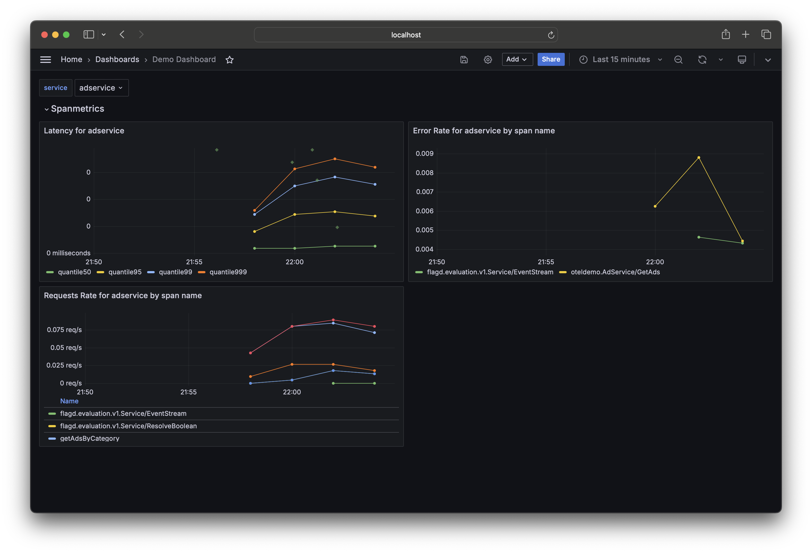
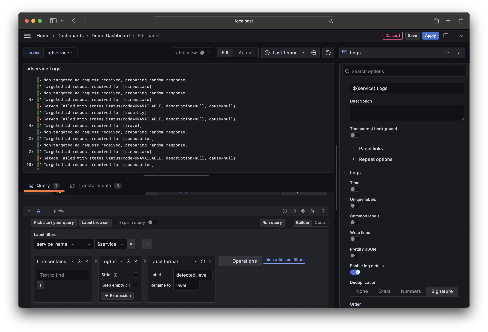

# Exercise 5: Create a Dashboard

In this section, we will create a dashboard to visualize the data collected for our OpenTelemetry instrumented application.

## Prerequisites

Make sure you have started the services required for the workshop. If you haven't done so, follow the instructions in the [Local setup](./02-setup.md) section.

## Create a dashboard

1. Open [localhost:8080/grafana](http://localhost:8080/grafana) in your browser.
2. In the left menu, and click on the [Dasbhaords](http://localhost:8080/grafana/dashboards) item.
3. Click on the [New](http://localhost:8080/grafana/dashboard/new) button to create a new dashboard.


Start by clicking the gear icon in on the top navigation bar. This will open the settings for the dashboard. Give the dasshboard a descriptive name, such as `OpenTelemetry Workshop`.


Click on the `Variables` tab and add a new variable. Name the variable `service` and set the type to `Query`.

In the Query Options section, set the following values:

- Data source: `Prometheus`
- Query type: `Label values`
- Label: `service`
- Metric: `traces_spanmetrics_latency_count`

You should see a list of services in the Preview values section to confirm that the query is working correctly.

Click on the `Apply` button to save the variable and click on the `Save dashboard` button in the top navigation bar to save your changes.


## Our first panel

Now we are ready to add some panels to our dashboard, start by clicking the prominent `+ Add visualization` button.

Let's start by visualizing span latency for our application.

Select the `Prometheus` data source, this will bring up the query builder that we will use to create our panel.

Select the following parameters:

- Metric: `traces_spanmetrics_latency_bucket`
- Label filters: `service` `=` `${service}`

Click on the `hint: add histogram_quantile` link to add the quantile function to the query.

!!! note

    A histogram is a type of metric that samples observations (usually things like request durations or response sizes) and counts them in configurable buckets. It also provides a sum of all observed values.

    The `histogram_quantile` function is built into the PromQL query language and calculates the selected quantile over time from a histogram.

    :question: What histogram quantile are we using to visualize the span latency?

Click on the `Run query` button to see the results of the query.


!!! note

    :question: What is the prometheus query that we are using to visualize the span latency?

    <details>
    <summary>Hint</summary>

    The PromQL query is displayed below the query builder filters. It should look like this:

    ```promql
    histogram_quantile(0.95, sum by(le) (rate(traces_spanmetrics_latency_bucket{service="$service"}[$__rate_interval])))
    ```
    </details>

Whenever you cange the service variable, the panel will update to show the span latency for the selected service. Try it for yourself!

Now let's add the other quantiles to the panel. Either click ont the `Add query` button below the query builder or click on the `Duplicate query` button to create a copy of the current query and change the quantile value.

Add the following qunatiles: `0.5`, `0.9`, and `0.99`. Click on the `Run query` button to see the results.

Lets add some better legends for the queries. Click on the `Options` tab and set the `Legend` field to the following values:

- `0.5`: `quantile50`
- `0.9`: `quantile90`
- `0.95`: `quantile95`
- `0.99`: `quantile99`

On the right hand side of the panel, you can set the panel title to `Latency for ${service}`.

The last thing we are going to do is enable exemplars in our panel. Exemplars are a powerful feature of Prometheus that allow you to see the exact trace that contributed to a specific data point in order to jump directly to trace view.

In the `Options` tab for one of the queries, enable the `Exemplars` option.


Click ont eh `Apply` button to save the changes to the panel and you should see the first panel in your dashboard. Click on the floppy disk icon in the top navigation bar to save the dashboard.

Create two more panels to visualize the request rate and the error rate for different spans for the selected service using the `traces_spanmetrics_calls_total` and `traces_spanmetrics_latency_count` respectively.

!!! note

    :question: What PromQL queries are we using to visualize the request rate and error rate?

    <details>
    <summary>Hint</summary>

    The PromQL queries are displayed below the query builder filters. They should look like this:

    ```promql
    sum by (span_name) (rate(traces_spanmetrics_latency_count{service="${service}"}[$__rate_interval]))
    ```

    ```promql
    sum by (span_name) (rate(traces_spanmetrics_calls_total{status_code="STATUS_CODE_ERROR", service="${service}"}[$__rate_interval]))
    ```
    </details>

    :question: What spans are currently generating errors?

    <details>
    <summary>Hint</summary>

    You can see the spans that are generating errors by selecting the `adservice`.
    </details>

    :question: How can you show only the span name in the legend?

    <details>
    <summary>Hint</summary>

    You can show only the span name in the legend by setting the `Legend` field to `{{span_name}}`.
    </details>

Lastly, add a row to the dashboard by clicking the `Add to` button in the top navigation and the `Row` option. Our panels will be added to this row and we can give it a title by clicking on the gear icon by hovering over the row name and giving it a new title, such as `Span Metrics`.



## Adding logs to the dashboard

Start by adding a new row to the dashboard and give it a title, such as `Application Logs`. Next, click the `Add to` button and select `Visualization` to add a new panel.

Here are some hints to help you create the log panel:

* Select the `Logs` visualization type.
* Select the `Loki` data source.
* Label filters should be set to: `service_name` `=` `${service}`
* Add logfmt parser
* Add label level format

Click on the `Run query` button to see the results of the query.

!!! note

    :question: What is the resulting LogQL query?

    <details>
    <summary>Hint</summary>

    The LogQL query is displayed below the query builder filters. It should look like this:

    ```promql
    {service_name="$service"} |= `` | logfmt | label_format level=detected_level
    ```
    </details>

As a bonus look at the different Logs visualization options and try to customize the panel to your liking. Click on the `Apply` button to save the changes to the panel and you should see the logs panel in your dashboard.



Let's also hadd a pie chart to visualize the different log levels for the selected service. Add a new panel to the `Logs` by clicking on the `Add to` button and selecting `Visualization`.

Here are some hints to help you create the pie chart panel:

* Select the `Pie Chart` visualization type.
* Select the `Loki` data source.
* Label filters should be set to: `service_name` `=` `${service}`
* Add logfmt parser
* Add label level format
* Add a rate range function to the query
* Add a sum aggregation to the query on the `level` label

Click on the `Run query` button to see the results of the query.

!!! note

    :question: What is the resulting LogQL query?

    <details>
    <summary>Hint</summary>

    The LogQL query is displayed below the query builder filters. It should look like this:

    ```promql
    sum by(level) (rate({service_name="$service"} |= `` | logfmt | label_format level=detected_level [$__auto]))
    ```
    </details>

    :question: Select different services, what is the distribution of log levels for service?
